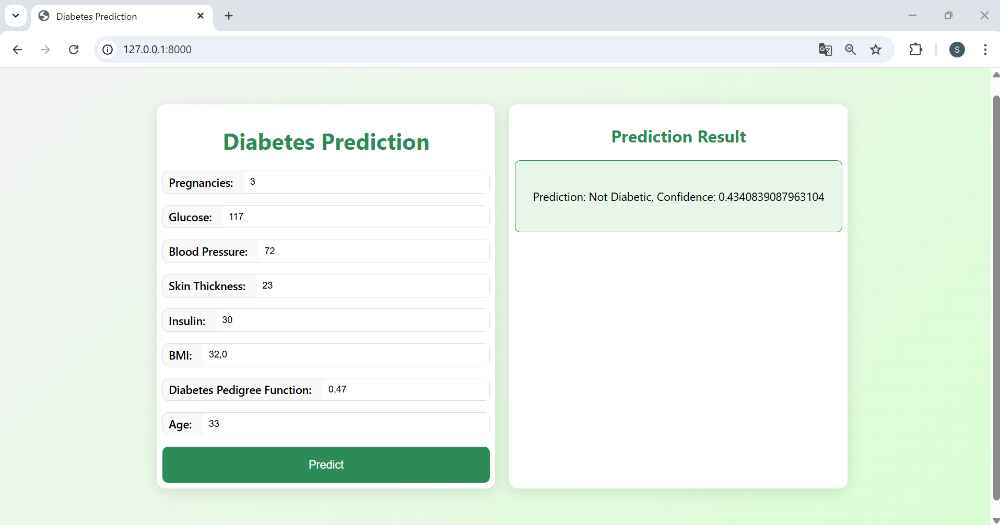

<!-- # Usage
```bash
uvicorn main2:app --reload
```

http://127.0.0.1:8000/api
http://127.0.0.1:8000
http://127.0.0.1:8000/docs
http://127.0.0.1:8000/redoc
formulaire est accessible sur http://127.0.0.1:8000/ et le message JSON sur http://127.0.0.1:8000/api -->

# Diabetes Detection API

## Overview
This is a simple and user-friendly API designed to detect diabetes using a deep learning model. The API allows users to input health data and receive a prediction of whether they are diabetic or not. It also includes a training feature for data scientists to update the model.

## Features
- **Train the model:** Use the `/train/` endpoint to train the deep learning model with the provided dataset.
- **Make predictions:** Use the `/predict/` endpoint to predict diabetes based on user data.
- **Web form for users:** An easy-to-use web form at the root URL (`/`) for users to enter their information and get a prediction.
- **Training loss visualization:** Track training loss with plots available at `/get-loss-plot/{epoch}`.

## Endpoints

### For Data Scientists
- `POST /train/` — Trains the model and saves it.
- `GET /get-training-loss/` — Returns training loss data.
- `GET /get-loss-plot/{epoch}` — Shows a plot of the loss at a given epoch.

### For Users
- `GET /` — Displays a simple form for users to input health data.
- `POST /predict-web/` — Predicts diabetes based on the form data.
- `POST /predict/` — Accepts JSON data and returns a prediction.

## How to Run
1. **Clone the repository:**
   ```bash
   git clone <repository_url>
   cd <repository_folder>
   ```
2. **Install dependencies:**
   ```bash
   pip install -r requirements.txt
   ```
3. **Run the FastAPI server:**
   ```bash
   uvicorn main:app --reload
   ```
4. **Access the web interface:**
   - Open your browser and go to [http://localhost:8000](http://localhost:8000) or [http://127.0.0.1:8000](http://127.0.0.1:8000)
5. **API Docs:**
   - View the interactive API docs at [http://localhost:8000/docs](http://localhost:8000/docs) or [http://127.0.0.1:8000/doc](http://127.0.0.1:8000/doc)

## Example JSON for Prediction
```json
{
  "Pregnancies": 2,
  "Glucose": 120.0,
  "BloodPressure": 70.0,
  "SkinThickness": 25.0,
  "Insulin": 80.0,
  "BMI": 28.5,
  "DiabetesPedigreeFunction": 0.5,
  "Age": 30
}
```

## Folder Structure
```
.
├── main.py
├── templates
│   └── form.html
├── static
│   └── images
├── requirements.txt
└── README.md
```

## Technologies Used
- **FastAPI** for the web framework
- **TensorFlow/Keras** for the deep learning model
- **Pandas** for data manipulation
- **Matplotlib** for visualizing training loss
- **Joblib** for model and scaler serialization


## Preview


---

Feel free to contribute or suggest improvements! ✨

